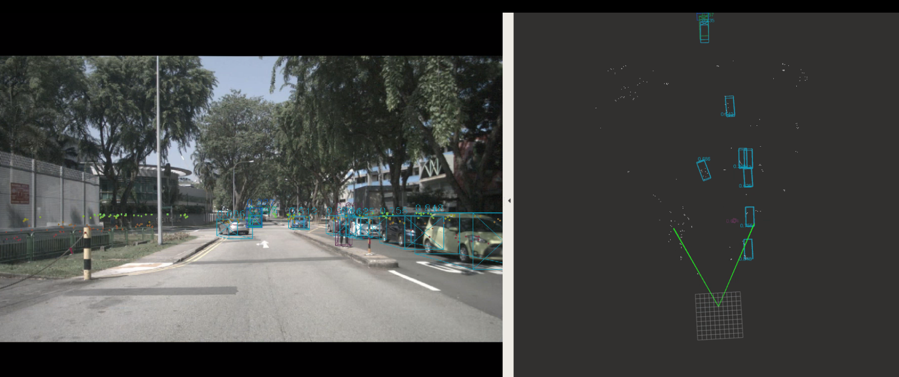

# 视觉毫米波雷达融合

## Todo List
- DCNv2 source code & Trt plugin support 
- rviz visualization
- center fusion source code 
- center fusion onnx exporting script
- Frustum association method illustration

## 输入
多个摄像头、多个毫米波雷达

* 初始化： 
  * 同视觉人车
* 每帧
  * 同视觉人车
  * 毫米波雷达
    * xyz
    * vx
    * vy
    * confidence

## 输出
* 同视觉人车

